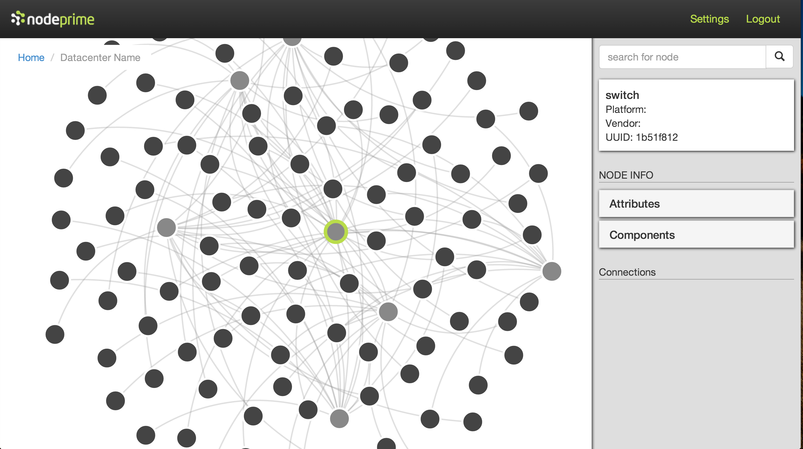
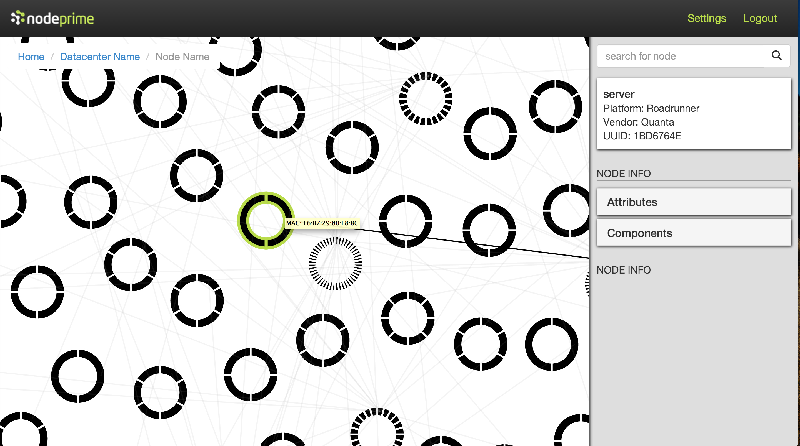
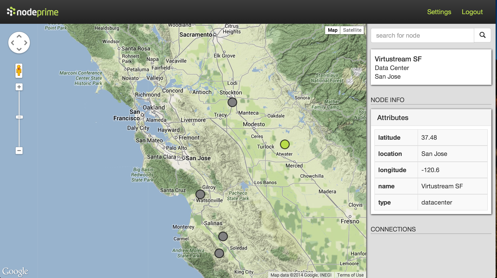

# Network Visualizer
Network Topology Visualizer is a web application that provides a visual representation of servers, switches and connections in a Data Center. The tool provides an easy-to-use interface providing users information on the various components in the Data Center.

## Setup
* Make sure [mongoDB](http://www.mongodb.org/) is installed and running on default port by running `mongod`
* While in the project folder run `npm install` to get dependencies
* [Generate](https://github.com/NodePrime/hackreactorproject/edit/develop/README.md#generating-data) a new set of mock data
* Run `gulp` to compile the application, and start the server
* Navigate to `localhost:8080` in web browser

## Generating Data
* Run `gulp generate` in project folder to generate a set of mock data
* Adjust the quantities of servers, switches, and data centers in the **Config** section of gulpfile.js

## Making requests to the server
* GET /all-zoomed to get all server / switch data, formatted for D3 (nodes and links arrays)
* GET /server to get server data
* GET /server/:id to get specific server data
* GET /switch to get all switch data
* GET /switch/:id to get specific switch data
* GET /connection to get all connection data
* GET /data-center to get all data center info

## Views

The tool displays various information in three different views:
* Network Main View
* Network Zoomed In View
* Network DGeo View

### Network Main View

This view provides a global view of all the switches and servers in a Data Center. An individual server or a switch can be selected and detailed information about the selected component would be displayed in the drop-down panel on the right hand side. Hovering the mouse over a component also pop-ups a tooltip that provides limited information. A link could also be clicked and this would highlight the link and show the components that it is connected to. The view could also be zoomedIn/ ZoomedOut to provide required granularity using the mouse.

###Network ZoomedIn View

This view can be rendered when a server or a switch is double-clicked in the Network Data Main View. This view provides more detailed information about a server or a switch complete with all the MAC addresses on the component. Hovering the mouse over a segment on a node would display its MAC address. A node could also be selected (by mouse clicking) and this would provide the user with detailed information about the node through the drop down panel on the right hand side (similar to the Network Data Main View)

###Network Geo View

This view uses the Google Maps API to render the location of data centers on various geographical locations. When a data center on this view is double clicked, detailed information about that data center would be rendered through the Network Data Main View. A data center could also be searched for using the search panel.
